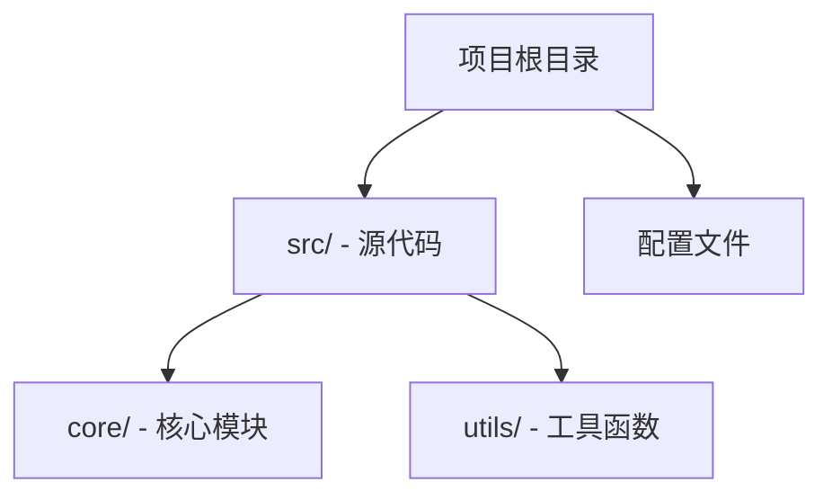
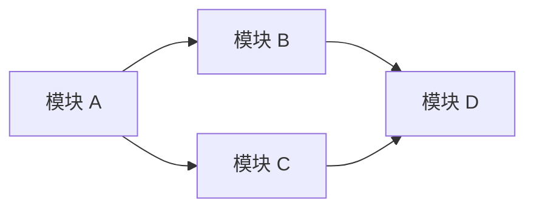
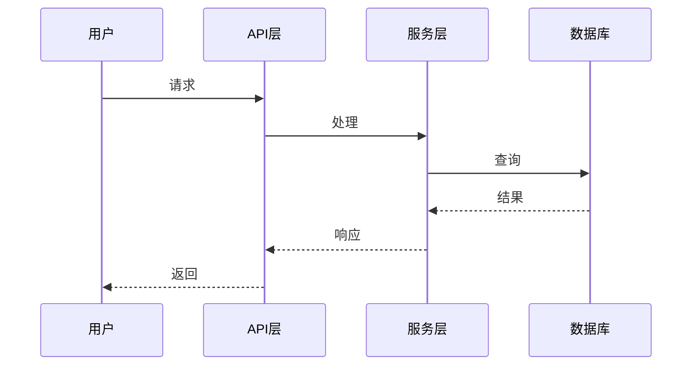

# REPOWIKI.md 报告格式规范

生成的报告必须严格遵循以下分层结构，输出为**单个** Markdown 文件。示例以 TypeScript 项目为例，不代表用户实际项目信息。

## 第一层：项目概述

```markdown
# {项目名称}

> {一句话项目定位描述}

## 目的与范围

{2-3 段落：解决什么问题、核心价值、目标用户}

## 技术栈

| 类别     | 技术 | 用途 |
| -------- | ---- | ---- |
| 语言     | ...  | ...  |
| 框架     | ...  | ...  |
| 构建工具 | ...  | ...  |
| 测试     | ...  | ...  |
| 数据库   | ...  | ...  |

## 仓库结构

{Mermaid 图表：顶层目录结构和模块关系}

## 核心系统概览

{Mermaid 图表：主要子系统之间的交互}
```

## 第 1.5 层：概念与设计理念

在项目概述和模块分析之间，添加一个解释项目**核心思想和技术原理**的章节——不是它做什么，而是为什么这样设计。

```markdown
## 设计理念与关键决策

### 核心概念

{1-2 段落：驱动项目设计的基本洞察或方法}

### 关键技术决策

| 决策点           | 选择      | 放弃                 | 原因                   |
| ---------------- | --------- | -------------------- | ---------------------- |
| {例如：状态管理} | {Zustand} | {Redux, Context API} | {原因——具体的权衡分析} |

### 架构原则

{2-4 个要点：从代码中提取的非显而易见的设计原则}
```

## 第二层：模块与包分析

```markdown
## 模块清单

| 模块 | 路径 | 职责 | 关键依赖 |
| ---- | ---- | ---- | -------- |
| ...  | ...  | ...  | ...      |

## 模块依赖架构

{Mermaid 图表：模块间依赖关系图}

## {模块名称} 详细分析

<details>
<summary>相关源文件</summary>

- `path/to/file1.ts` - 整个文件（不带行号）
- `path/to/file2.ts#L5-L10` - 具体代码段（带行号）

</details>

### 职责与边界

{该模块负责什么、不负责什么}

### 内部架构

{Mermaid 图表：模块内的类/函数关系}

### 关键接口

{代码块：主要导出的 API、类型定义、接口}

### 数据流

{Mermaid 序列图/流程图：模块内数据如何流动}
```

## 第三层：核心系统深度分析

为每个核心系统生成独立章节：

```markdown
## {系统名称}

<details>
<summary>相关源文件</summary>

- `path/to/relevant/file.ts#L1-L10`

</details>

### 问题与方法

{每个核心系统章节以叙事弧线开始：该系统解决什么问题？传统/朴素方法为什么行不通？本项目使用什么洞察或方法？}

### 系统架构

{Mermaid 图表：系统整体架构图}

### 核心工作流

{Mermaid 序列图：主要业务流程}

### 关键组件

| 组件 | 文件 | 职责 |
| ---- | ---- | ---- |
| ...  | ...  | ...  |

### 设计决策与权衡

| 决策点 | 选择 | 放弃 | 原因 |
| ------ | ---- | ---- | ---- |
| ...    | ...  | ...  | ...  |

### 配置与扩展点

{代码块：关键配置文件片段}
```

## 第四层：基础设施与工具链

```markdown
## 构建系统

### 构建流程

{Mermaid 流程图：从源码到产物的完整过程}

### 构建配置

{表格：关键构建配置项}

## 测试基础设施

### 测试策略

| 测试类型 | 工具 | 覆盖范围 |
| -------- | ---- | -------- |
| 单元测试 | ...  | ...      |
| 集成测试 | ...  | ...      |
| E2E 测试 | ...  | ...      |

### 测试配置

{代码块：关键测试配置文件片段}

## CI/CD 流水线

{Mermaid 流程图：CI/CD 流程}

## 依赖管理

### 关键依赖

| 依赖 | 版本 | 用途 |
| ---- | ---- | ---- |
| ...  | ...  | ...  |

### 依赖策略

{版本锁定、更新策略、安全审计}
```

## Mermaid 图表规范

**语法红线（以 Mermaid v10+ 为准）：**

- 标签一律使用 `["..."]` 包裹，可消除特殊字符风险。
- 图表类型声明（graph、flowchart、sequenceDiagram、stateDiagram-v2）必须与正文语法匹配。

<details>
<summary>Legacy (Mermaid ≤ v8)</summary>

如目标环境为 v8 及以下，额外避免在 unquoted 文本中使用 `()[]{};`——它们会破坏旧版解析器；可用 `（）`（全角）或重新措辞。

</details>

每份报告必须包含：

- **仓库结构图**（必需）：graph TD 展示顶层目录和模块关系
- **模块依赖图**（必需）：graph LR 展示模块间实际 import/依赖
- **核心工作流序列图**（必需）：sequenceDiagram 展示主要业务流程
- **数据流图**（按需）：系统含复杂数据流转时用 flowchart
- **状态/生命周期图**（按需）：系统含状态机时用 stateDiagram-v2

必需的三种图各一个示例：







## 源文件引用规范

每个核心系统/模块章节必须包含可折叠的源文件引用；概述、设计理念等元章节若无直接源文件，可省略 `<details>` 块，但必须在正文中说明判断依据来自哪些已读文件。

引用规则：

- 仅引用与当前章节**直接相关**的文件
- 每个引用附带简要描述
- 按重要性排序，最关键的文件在前
- 每个核心系统/模块章节 3-10 个引用文件；引用具体代码段必须带 `file#Lx-Ly` 行号，引用整个文件可不带行号

## 表格使用规范

技术栈、模块清单、配置对比、API 清单、依赖清单等场景如存在对应内容则使用表格；无对应内容时省略该小节。

## 输出要求

1. **文件名**：`REPOWIKI.md`，放在仓库根目录
2. **语言**：与用户对话语言一致
3. **相对密度**：每个核心系统章节不少于 500 字 + 至少 1 个 Mermaid 图 + 3-10 个源文件引用，按实际代码量伸缩
4. **图表数量**：至少 3 个 Mermaid 图表，大型项目 6-10 个
5. **表格数量**：至少 3 个表格
6. **代码块**：关键配置和接口定义，每个不超过 30 行

## 语言/框架适配

根据项目类型调整分析重点：

| 项目类型           | 分析重点                                 |
| ------------------ | ---------------------------------------- |
| Node.js/TypeScript | package.json、tsconfig、模块导出         |
| Go                 | go.mod、包结构、接口定义                 |
| Python             | pyproject.toml、包结构、类层次结构       |
| Rust               | Cargo.toml、crate 结构、trait 定义       |
| Java/Kotlin        | pom.xml/build.gradle、包结构、类层次结构 |
| Monorepo           | 工作区配置、包间依赖、构建顺序           |
| 前端 SPA           | 路由结构、状态管理、组件树               |
| 后端 API           | 路由定义、中间件链、数据模型             |
| CLI 工具           | 命令结构、参数解析、子命令               |
